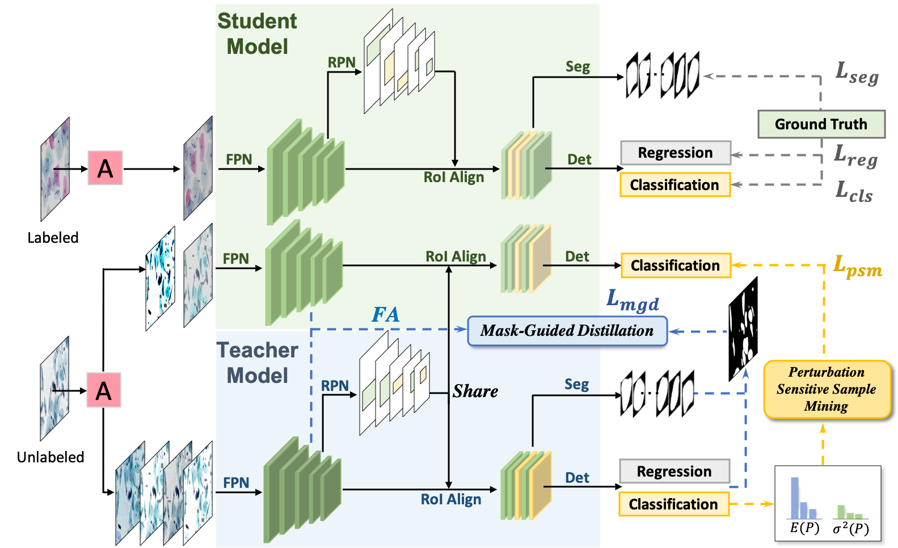

# MMT-PSM
Code for Deep Semi-supervised Knowledge Distillation for Overlapping Cervical Cell Instance Segmentation


## Installation
1. The basecode for this project is built on Detectron-V1.
Check [INSTALL.md](INSTALL.md) for instructions.
2. We also provide a modified pycocotools file with a new function ``iouIntUni`` to compute intersection over union between masks, return iou, intersection, union together. 
If you want to use this function, follow the install instruction from official pycocotools and replace the file with the same name in the path ``pycoco``.

## Abstractions
For more information on some of the main abstractions in detectron-v1 implementation, see [ABSTRACTIONS.md](ABSTRACTIONS.md).

If you have issues running or compiling this code, we have compiled a list of common issues in
[TROUBLESHOOTING.md](TROUBLESHOOTING.md). If your issue is not present there, please feel
free to open a new issue.

## Dataset Preparation
We provide the code for our dataset class. 
The annotation style of the dataset is similar to COCO style.

Specifically, a sliding window is used to crop image into 1000*1000 resolution with 0.75 overlapping ratio for training. 
For eval and test, overlapping ratio is set to 0.

Due to the cropping procedure, there may be some tiny objects in the edge of the image. 
We skip the tiny object ground truth by ``self.filter_gt()``.

Patches without any objects are also removed by ``self._remove_unsuitable_patches()``.

## Training
To train MMT-PSM 
```angular2
cd MMT-PSM
sh scripts/train_mt.sh
```
To train without mean teacher framework, you can set ``DATASETS.NO_LABEL False`` (do not use unlabeled dataset) or set ``MT.LAMBDA 0.`` (weight for consistency loss equals to 0.).

To use Mask R-CNN (ResNet-50 + FPN) as base model (which means to not use IR-Net), set ``MODEL.RELATION_NMS.USE_RELATION_NMS False`` and ``MODEL.RELATION_MASK.USE_RELATION False``.

Other hypers:
```angular2

MT.LAMBDA 5. #weight for consistency losses (l_{psm} and l_{mgd})
MT.FG_HINT 1. # weight for l_{mgd}
MT.CLS_LOSS # weight for l_{psm}
MT.RAMPUP_STEP 250 # a warm up step to gradually increase consistency loss weight using sigmoid-shaped function
MT.RAMPDOWN_STEP 250 # a rampdown step to decrease the weight at the end of training
MT.AUG_K 2 # do k times color augmentation for unlabeled data, if MT.FLIP = True, there will be 4 augmented images with 2 color augs and 2 filpped version for each input.  
```
## TESTING
```angular2
cd MMT-PSM
sh scripts/test.sh
# Hypers:
DATASETS.MODE_IN_TEST 'test' # use 'val' or 'test' to switch the evaluation in val set/test set
MODEL.RELATION_NMS.REG_IOU True # if use IR-Net
```
Evaluation metrics of AJI and mAP are used. 
If you use AJI, a modified version of ``pycocotools`` is needed (see Installation 2.).

## Future Work
This repo may contain some useless hyperparameters. In future we will check again and remove them.

## Acknowledgement
Our project is based on code from [Detectron](https://github.com/facebookresearch/Detectron) (version one).
## Citations
Please consider citing the following papers in your publications if they help your research.
```
@inproceedings{zhou2020deep,
  title={Deep Semi-supervised Knowledge Distillation for Overlapping Cervical Cell Instance Segmentation},
  author={Zhou, Yanning and Chen, Hao and Lin, Huangjing and Heng, Pheng-Ann},
 booktitle={International Conference on Medical Image Computing and Computer-Assisted Intervention},  
 organization={Springer}
  year={2020}
}
@inproceedings{zhou2019irnet,
  title={IRNet: Instance relation network for overlapping cervical cell segmentation},
  author={Zhou, Yanning and Chen, Hao and Xu, Jiaqi and Dou, Qi and Heng, Pheng-Ann},
  booktitle={International Conference on Medical Image Computing and Computer-Assisted Intervention},
  pages={640--648},
  year={2019},
  organization={Springer}
}
```

## License

maskrcnn-benchmark is released under the MIT license. See [LICENSE](LICENSE) for additional details.
